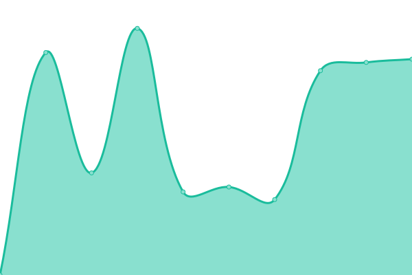

# [📈 Live Status](https://uptime.playgeorge.town): <!--live status--> **🟧 Partial outage**

This repository contains the open-source uptime monitor and status page for [Ryan P](https://uptime.playgeorge.town), powered by [Upptime](https://github.com/upptime/upptime).

With [Upptime](https://upptime.js.org), you can get your own unlimited and free uptime monitor and status page, powered entirely by a GitHub repository. We use [Issues](https://github.com/mifd670/GeorgetownStatus/issues) as incident reports, [Actions](https://github.com/mifd670/GeorgetownStatus/actions) as uptime monitors, and [Pages](https://uptime.playgeorge.town) for the status page.

<!--start: status pages-->
<!-- This summary is generated by Upptime (https://github.com/upptime/upptime) -->
<!-- Do not edit this manually, your changes will be overwritten -->
<!-- prettier-ignore -->
| URL | Status | History | Response Time | Uptime |
| --- | ------ | ------- | ------------- | ------ |
|  [Website](https://playgeorge.town) | 🟩 Up | [website.yml](https://github.com/MIFD670/georgetown/commits/HEAD/history/website.yml) | 

 3563ms
     
 | 

<a href="https://uptime.playgeorge.town/history/website">99.00%</a>
    

|  Game Database | 🟥 Down | [game-database.yml](https://github.com/MIFD670/georgetown/commits/HEAD/history/game-database.yml) | 

 0ms
     
 | 

<a href="https://uptime.playgeorge.town/history/game-database">0.00%</a>
    

<!--end: status pages-->

[**Visit our status website →**](https://uptime.playgeorge.town)

## 📄 License

- Powered by: [Upptime](https://github.com/upptime/upptime)
- Code: [MIT](./LICENSE) © [Ryan P](https://uptime.playgeorge.town)
- Data in the `./history` directory: [Open Database License](https://opendatacommons.org/licenses/odbl/1-0/)
